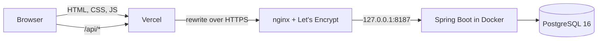

# PayFlow

[](https://github.com/theamir29/payflow/actions/workflows/ci.yml)

A digital wallet backend in **Java 17 and Spring Boot 3.5**: accounts in UZS and USD, deposits, transfers
between users, operation history and monthly statistics, with a small web client on top.

The interesting part is not the CRUD but the money: transfers stay correct when many of them hit the same
account at once, a retried request never charges twice, and there are tests that prove both.


## Live demo

- **Web client:** https://payflow-taupe-xi.vercel.app — or open the demo wallet straight away:
  https://payflow-taupe-xi.vercel.app/?demo
- **API docs (Swagger UI):** https://payflow-taupe-xi.vercel.app/swagger-ui/index.html
- **Demo user:** `demo@payflow.uz` / `demo12345`, shared by everyone, so the data may have been changed
  by other visitors. Register your own user for a clean wallet.

## Features

- Registration and login with stateless JWT (Spring Security OAuth2 resource server, HS256)
- Accounts in UZS and USD, numbered like Uzbek bank accounts: `20206 000 7626 7341 7905` —
  balance account, currency code (`000` for UZS, `840` for USD), unique part
- Deposits, and transfers by account number with a recipient lookup that shows only a masked name ("Азиз К.")
- Safe retries of transfers with an `Idempotency-Key` header
- Operation history filtered by account, type and period, paginated
- Income and expense per month
- OpenAPI description with Swagger UI
- Every error is RFC 7807 `application/problem+json` with a stable `code` such as `INSUFFICIENT_FUNDS`

## Stack

Java 17 · Spring Boot 3.5 (Web, Data JPA, Validation, Security, OAuth2 Resource Server, Actuator) ·
Hibernate 6 · PostgreSQL 16 · Flyway · springdoc-openapi · JUnit 5 · Mockito · MockMvc · H2 for tests ·
Maven · Docker · Docker Compose · GitHub Actions · nginx · Vercel

The web client is plain HTML, CSS and JavaScript with no build step.

## Engineering notes

### Transfers under concurrency

A transfer locks both account rows with `SELECT … FOR UPDATE`
([`AccountRepository.lockByIdsInOrder`](backend/src/main/java/uz/payflow/account/AccountRepository.java)).
Rows are always locked in ascending id order, so two opposite transfers A→B and B→A wait for each other
instead of deadlocking.

There is a subtler trap. If the service first loads the accounts normally and only then runs the locking
query, Hibernate returns the entities it already holds in the persistence context, with balances read
*before* the lock. The update then writes a value computed from a stale balance. So
[`PaymentService`](backend/src/main/java/uz/payflow/operation/PaymentService.java) resolves only the ids
up front; the entities are loaded for the first time by the locking query.

[`ConcurrentTransfersTest`](backend/src/test/java/uz/payflow/operation/ConcurrentTransfersTest.java)
starts 20 transfers at the same moment against a real database. I broke the code on purpose to make sure
the test notices:

| Variant | Outcome |
|---|---|
| As implemented | 10 transfers of 10.00 succeed from a balance of 100.00, 10 are refused, final balance 0.00 |
| Lock removed | all 20 "succeed": money is created from nothing |
| Accounts loaded before locking | lost updates: 986.00 instead of 980.00 with opposite transfers |

### Retries without double charges

A client that times out cannot know whether the transfer went through. With an `Idempotency-Key` it can
simply send the same request again: the first call answers `201 Created`, every repeat answers
`200 OK` with `Idempotent-Replayed: true` and the original operation. Reusing a key for a different
transfer is a `409 IDEMPOTENCY_KEY_REUSED`. A `UNIQUE (initiated_by, idempotency_key)` constraint settles
the race when two identical requests arrive together. The web client keeps the key across attempts, so
pressing "Перевести" again after a network error is safe.

### Money and data integrity

- Amounts are `BigDecimal` in the code and `NUMERIC(19, 2)` in the database; validation rejects more than
  two decimal places, so nothing is ever rounded silently.
- Balance rules live on the entity (`Account.debit` / `credit`), the only code that changes a balance.
  The database repeats them: `CHECK (balance >= 0)`, `CHECK (amount > 0)`.
- Operations are an append-only ledger; nothing is updated or deleted.

### Other details

- **No N+1 queries.** A history page loads both accounts and their owners through an `@EntityGraph`:
  one query plus a count, instead of up to 81 queries for 20 rows.
- **No probing.** Another user's account answers exactly like a missing one (`404`), and login gives the
  same answer for an unknown email and a wrong password.
- **Schema owned by Flyway.** Hibernate only validates it. The same migration runs on PostgreSQL in
  production and on H2 in tests.
- **Fail fast on configuration.** The `prod` profile does not start without `JWT_SECRET`, and no profile
  starts with a key shorter than 256 bits.
- **Testable time.** Code gets a `Clock` bean instead of calling `Instant.now()`.

## API

| Method | Path | What it does |
|---|---|---|
| `POST` | `/api/auth/register` | Create a user with a first UZS account, returns a token |
| `POST` | `/api/auth/login` | Returns a token |
| `GET` | `/api/me` | Current user |
| `GET` | `/api/accounts` | My accounts with balances |
| `POST` | `/api/accounts` | Open an account (up to 5) |
| `GET` | `/api/accounts/{id}` | One of my accounts |
| `GET` | `/api/accounts/lookup?number=…` | Recipient's masked name and currency |
| `POST` | `/api/accounts/{id}/deposits` | Top up (demo money) |
| `POST` | `/api/transfers` | Transfer; optional `Idempotency-Key` header |
| `GET` | `/api/operations` | History: `accountId`, `type`, `from`, `to`, `page`, `size` |
| `GET` | `/api/stats/monthly` | Income and expense per month: `currency`, `months` |

Full description: `/swagger-ui/index.html`. Demo user: `demo@payflow.uz` / `demo12345`.

## Running it

**Without a database** — in-memory H2, demo data, web client included:

```bash
cd backend
mvn spring-boot:run -Dspring-boot.run.profiles=local
```

Open http://localhost:8080.

**Full stack in Docker** — PostgreSQL, the API and nginx serving the web client:

```bash
docker compose up --build
```

Open http://localhost:8080.

**Tests:**

```bash
cd backend
mvn verify
```

| Test | Covers |
|---|---|
| `AccountTest` | Balance rules on the entity, masked names |
| `PaymentServiceTest` | Transfer rules with Mockito: funds, currency, same account, idempotent replay and key reuse |
| `PaymentFlowIntegrationTest` | The whole HTTP stack with MockMvc: security, validation, transfers seen from both sides, stats |
| `ConcurrentTransfersTest` | Parallel and opposite transfers against a real database |

## Deployment



- The web client is static and served by Vercel; `vercel.json` proxies `/api/*` and Swagger to the API,
  so the browser only ever talks to one origin and no CORS setup is needed.
- The API runs in Docker on a Linux VPS, bound to `127.0.0.1`; nginx terminates TLS and is the only
  public entry point. [`deploy/deploy.sh`](deploy/deploy.sh) pulls `main`, rebuilds the image and waits
  for the health check.
- Every push runs the tests on GitHub Actions, then builds the image and smoke-tests the whole Compose
  stack through nginx.

## Project layout

```
backend/
  src/main/java/uz/payflow/
    auth/        registration, login, JWT issuing
    account/     accounts, numbers, recipient lookup
    operation/   deposits, transfers, history
    stats/       monthly income and expense
    common/      API errors and the problem+json handler
    config/      security, OpenAPI, properties, @CurrentUserId
    demo/        demo data for the public instance
  src/main/resources/db/migration/   Flyway schema
frontend/        web client, deployed to Vercel
deploy/          nginx configs, env template, deploy script
```

---

Amir Baymuratov · [github.com/theamir29](https://github.com/theamir29)
